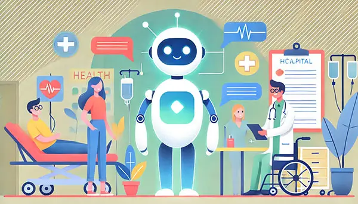

# Agentic-Healthcare-Support-Assistant
A conversational AI-powered healthcare support chatbot designed to provide users with reliable, context-aware responses to healthcare-related questions. Built using LangChain, FAISS, and a custom LLM model, it leverages advanced conversational retrieval techniques.

